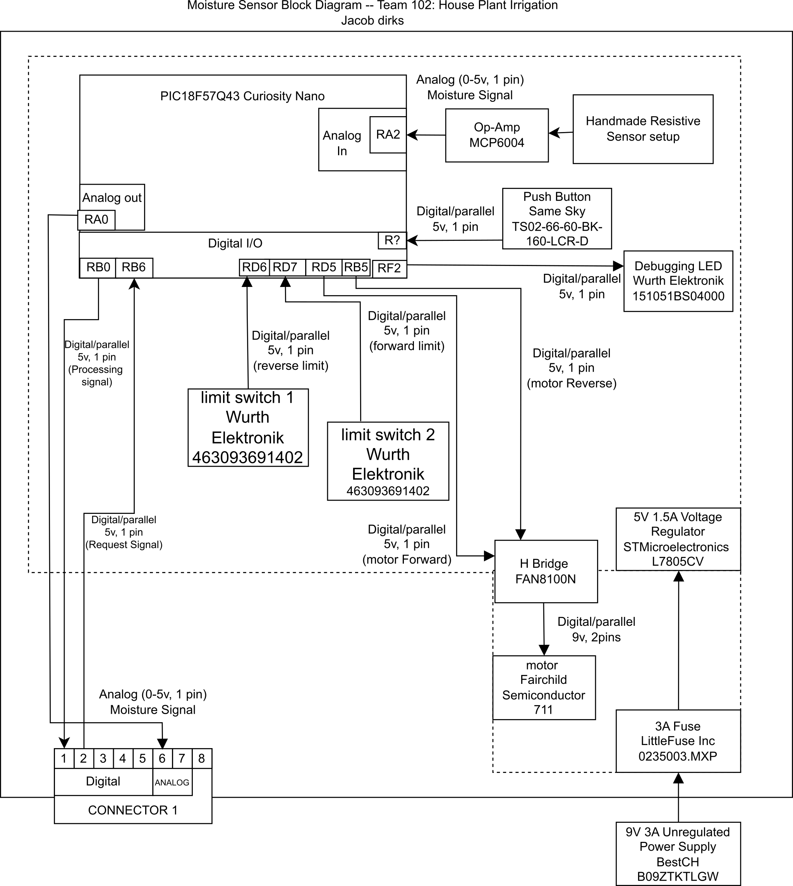

## Overview

This block diagram is part of a larger machine but still is able to work on its own to measure moisture. Two power levels are required which can be derived from the same 9v 3a power supply. This can supply power to both the motor at 12v levels (combined at the H-Bridge #FAN8100N) and the second power level is a 5v 1a which is obtained through the Voltage regulator (#L7805CV). This allows the Curiosity Nano to function at its desired power levels. This also enables sensing from the two limit switches (463093691402) and the capacitive sensor due to their operating ranges. Finally the h-Bridge, part number aforementioned, controls the motor (711) which will help keep the capacitive sensor safe when not actively reading values. Otherwise Pins that are being utilized help the curiosity nano communicate with the central hub nano for this team project.

<!--
This needs to be updated with a brief purpose for having the block diagram.
Things to mention are:
* power levels
* sensor
* Actuator
* team connections
* Power source
* ...

To get some initial formatting help, one can view ["here"](https://embedded-systems-design.github.io/EGR304DataSheetTemplate/Appendix/basic-markdown-examples/) some basic techniques.
-->

**Parts List for sensors and actuators that are involved in the diagram.**
Are available as a list here and with all the other options in [*Component Selection.*](https://jacobdirks.github.io/02-Component-Selection/Component-Selection/)
For the final choices and the amounts please visit the ["BOM"](https://jacobdirks.github.io/03-BOM/BOM/) section of the datasheet.

## **Individual Block Diagram**

{style="max-height:500px;"}

## **Project Verification**

This project has a number of requirements for both the team and the individual in order to be marked as a success.

### **Individual Subsystem Requirements**

> * A 5V Linear Regulator
> * Barrel Jack adapter for your 9V power supply
> * A pre-selected microcontroller: a Microchip PIC18F57Q43 Curiosity Nano Development Board
> * At least one distinct sensing or actuation functionality (four functionalities would be required across a four-person team)
> * While individual modules are expected to have either sensing or actuation functionality as a minimum, there is an expectation that a mix of both sensing and actuation functionalities will be present when all the team modules are connected together.
> * It is not permitted to replicate subsystem functionality within a team, or copy a classmate's design. Subsystems must be materially different, using different chips, design processes, and accomplishing different functions.
> * Individual subsystems are required to connect to teammates' boards using the connector listed above. It is up to the team to determine what information to pass and to whom, but individuals will be required to demonstrate basic connectivity and data passing capabilities before being able to connect their device to their team's connectors.

These traits can be seen in the block diagram for the individual subsection. On the bottom right of the block diagram we can see the 9V 3A Power supply which connects with the second bullet point. The barrel jack isn't placed on the block diagram as a block because that is a lower level detail that is covered by the higher details of voltage and amperage. Moving up directly from there we can find the 5V 1.5A voltage regulator and this part is a linear voltage regulator completing the first bullet point of requirements. This helps ensure that we have the correct level of power for the pre-selected microcontroller (top left to top center). In the case of this subsystem we have a distinct moisture sensing component which combines information in the other subsystems to tell the main controller whether or not to turn on a pump. Secondarily to ensure we meet sensing/actuation requirements the block diagram shows a motor as well as limit switches. These limit switches help control the range the motor operates in so that the motor can operate in a safe manner in relation to the moisture sensor. Finally returning to the bottom but this time on the left we can see the 8 pin connector used to communicate in between boards. Allowing for the final requirement to be seen through the jumper pin array as well as the direct connections to the micro controller.

## **Additional File Types**

This block diagram is available on [*as a draw io file*](images/DirksBlockDiagram.drawio) and it can be found [*in pdf form here*](images/EGR304IndividualBlockDiagram.pdf) and finally the combined files can be found ["as a zip file."](images/MoistureSensorblockDiagram.zip)
