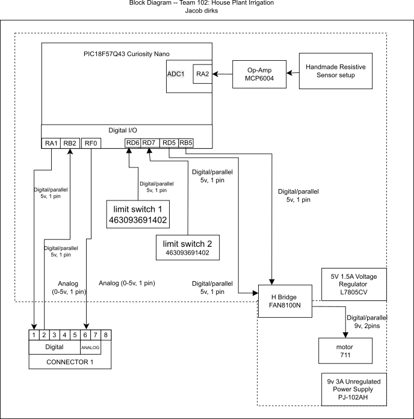

## Overview

This block diagram is part of a larger machine but still is able to work on its own to measure moisture. Two power levels are required which can be derived from the same 9v 3a power supply. This can supply power to both the motor at 12v levels (combined at the H-Bridge #FAN8100N) and the second power level is a 5v 1a which is obtained through the Voltage regulator (#L7805CV). This allows the Curiosity Nano to function at its desired power levels. This also enables sensing from the two limit switches (463093691402) and the capacitive sensor due to their operating ranges. Finally the h-Bridge, part number aforementioned, controls the motor (711) which will help keep the capacitive sensor safe when not actively reading values. Otherwise Pins that are being utilized help the curiosity nano communicate with the central hub nano for this team project.

<!--
This needs to be updated with a brief purpose for having the block diagram.
Things to mention are:
* power levels
* sensor
* Actuator
* team connections
* Power source
* ...

To get some initial formatting help, one can view ["here"](https://embedded-systems-design.github.io/EGR304DataSheetTemplate/Appendix/basic-markdown-examples/) some basic techniques.
-->

**Parts List for sensors and actuators that are involved in the diagram.**
Are available as a list here and with all the other options in [*Component Selection.*](https://jacobdirks.github.io/02-Component-Selection/Component-Selection/)
For the final choices and the amounts please visit the ["BOM"](https://jacobdirks.github.io/03-BOM/BOM/) section of the datasheet.

## **Individual Block Diagram**

{style="max-height:500px;"}

This block diagram is available on [*as a draw io file*](images/DirksBlockDiagram.drawio) and it can be found [*in pdf form here.*](images/EGR304IndividualBlockDiagram.pdf)
