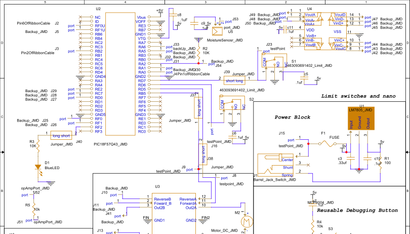
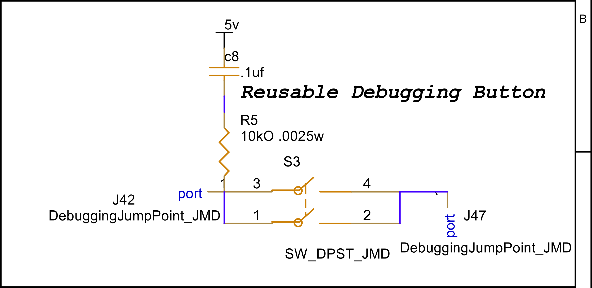
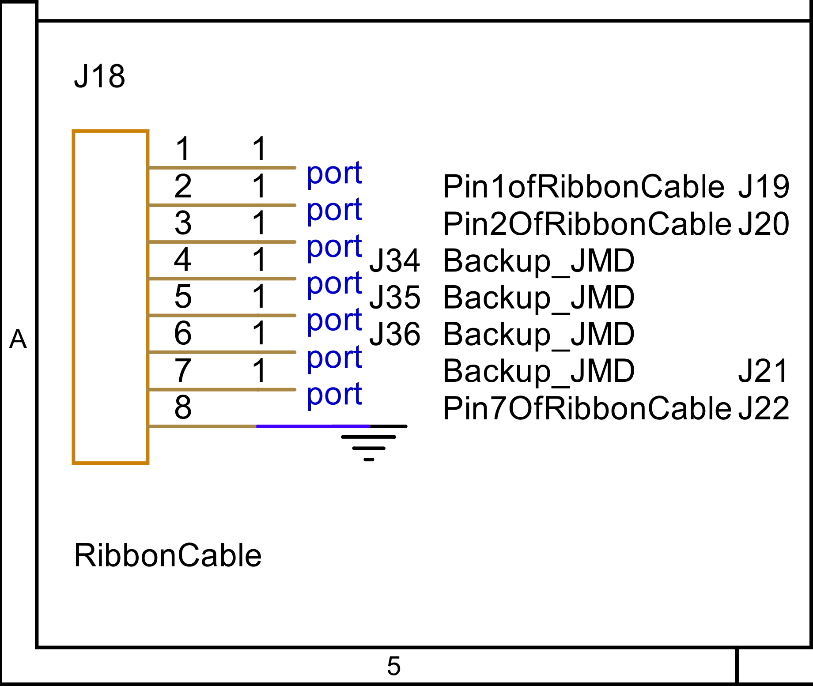

## Overview

This schematic is design to support <!--.... (highlight functionally, power, and controller).-->a motor that can move an arm to the limit switch in order to read the moisture of the soil. Through a 9v 3A power supply that is stepped down to a 5V 1A output. This secondary voltage is able to be used by the curiosity nano

{style="max-height:300px;"}

**Figure #1:** The full schematic.  

{style="max-height:300px;"}

**Figure #1:** Closer view on the nano portion.  

{style="max-height:300px;"}

**Figure #1:** Closer view on the debugging button schematic.  

{style="max-height:300px;"}

**Figure #1:** The ribbon cable in the schematic.  

## **Resources**

The schematic is available as a [*pdf file*](DirksSupplied/schematic.pdf), and the project is available as a [*zip folder*](DirksSupplied/MoistureSensor.zip).
