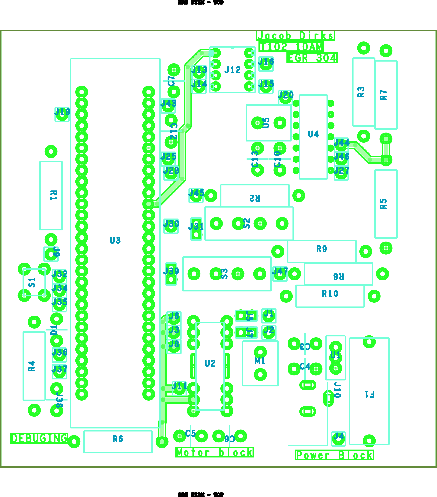
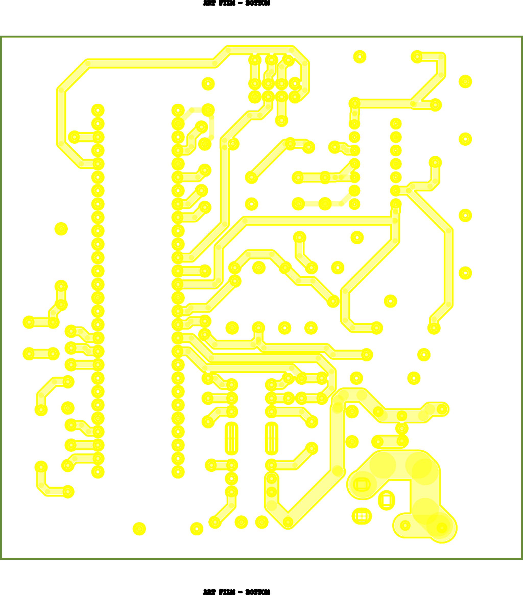

## Images

{style="max-height:300px;"}  

**Figure 1:** Top view of the PCB.

{style="max-height:300px;"}  

**Figure 2:** Bottom view of the PCB.

## Resources

PDF versions of the ["Top view"](supplied/moisturesensorTop.pdf), ["Bottom view"](supplied/moisturesensorBottom.pdf), and the ["Manufacturing zip files"](supplied/Dirks102.zip) are available for your leisure.
For the full project please get the zip file at the bottom of the ["Schematic"](https://jacobdirks.github.io/04-Schematic/schematic/) section of the database. Otherwise you can get the ["zip files here."](supplied/MoistureSensor.zip)
