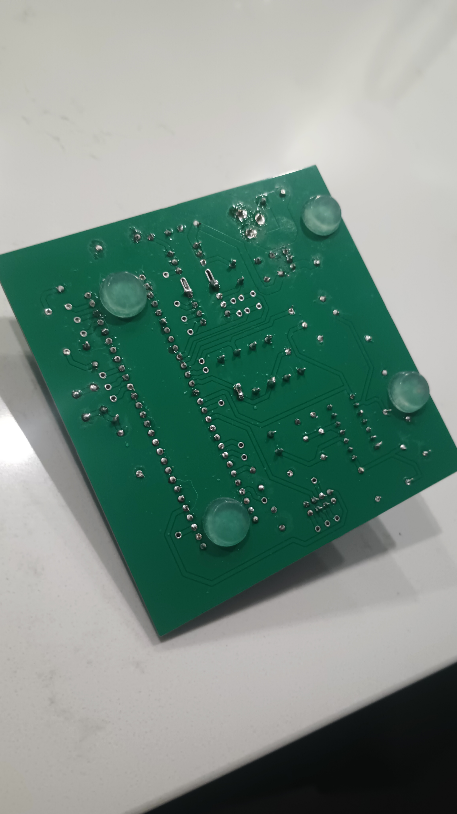

## Images

{style="max-height:300px;"}  

**Figure 1:** Top view of the PCB.

{style="max-height:300px;"}  

**Figure 2:** Bottom view of the PCB.

From those trace connections we can also build a simulation of it using the integrated Cadence software.

{style="max-height:300px;"}  

**Figure 3:** Top prediction of the PCB with the dark rectangular prisms being various parts.

{style="max-height:300px;"}  

**Figure 4:** Bottom prediction of the PCB without solder coverage.

After simulating the PCB, we can look towards manufacturing at least one PCB for real world usage.

{style="max-height:300px;"}  

**Figure 5:** Top of the PCB without any parts soldered on.

{style="max-height:300px;"}  

**Figure 6:** Bottom of the PCB without any parts soldered on.

{style="max-height:300px;"}  

**Figure 7:** Top of the PCB after being built.

{style="max-height:300px;"}  

**Figure 8:** Bottom of the PCB after being built.

## Resources

PDF versions of the ["Top view"](supplied/moisturesensorTop.pdf), ["Bottom view"](supplied/moisturesensorBottom.pdf), and the ["Manufacturing zip files"](supplied/Dirks102.zip) are available for your leisure.
For the full project please get the zip file at the bottom of the ["Schematic"](https://jacobdirks.github.io/04-Schematic/schematic/) section of the database. Otherwise you can get the ["zip files here."](supplied/MoistureSensor.zip)
